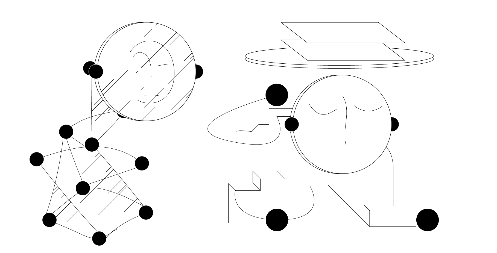

Over the years I have often found myself reading two or three books at a time. What I once attributed to a compulsion generated by boredom or attention deficit ended up becoming a habit I consciously stoked ... _pick up a book about ecology ... pick up another journal on planetary exploration_ ... rinse and repeat. It's incredibly rare for me to not pick up other books while reading any one thing.

The headspace I find myself often as I read is that of _connecting_, _relating_. I generally read to _learn_ and learn to _do_ — consuming texts is often a very intentional process that leads to the solving of a problem I have in work or life. Over the years I've become aware that for me, reading and otherwise consuming texts has been a method of generating intentional relationships with the greater world, and _specifically_ reading two books alongside one another is a method I've practiced to better generate links of information within my own mind.

I have come to internally refer to this method of personal reference-building as "Book Networking", or "Reading Networks". While texts often build and maintain an internal and pre-set collection of references in the form of footnotes, or prior foundational texts, or subtle cultural "calls" to "events or people or tropes of the time and place the text was written", it's a far more personal practice to form one's own links in an inter-textual manner.

I'm currently dedicating a large amount of space in my mind to the idea of cultivating concurrent groupings of people to [learn amongst one another, from one another](http://learning-gardens.co). What does it mean to formulate connective tissues amongst people's learning-desires? I ask myself this question every day.

Here's something related:

> _Gardening techniques_
>
> _Learning and memory are by default automatic processes; their efficacy is proportional to the relevance that the thing to be learned has to your life (frequency, neurons firing together, synaptic pruning, interconnections, etc.). You could say that this relevance acts as filter for incoming information._
>
> _There are reasons why you might want to sneak information past this filter ("artificial learning"):_
>
> 1. _To learn abstract knowledge that is far removed from daily life (e.g. math). This is done using analogies, mnemonics, examples, anthropomorphism, etc._
> 2. _To interfere with the process of "natural learning" with the goal of improving learning mechanisms, for example when learning a skill like playing the piano. This is done using deliberate practice, analysis, etc._
>
> _See these methods as gardening techniques. We either let the garden of the mind grow naturally or we sculpt it deliberately._

I'd like to think that building your own reading networks can foster a method of building personal abstractions, of building personal relevancy to any given topic, of improving deliberately the methods by which you consume others' ideas and structures.

—

Here are a few reading networks I've been building during the time of this posting:

[Designing Design](https://www.are.na/edouard-u/designing-design) and [Architecture Words 2: Anti-Object](https://www.are.na/edouard-u/architecture-words-2-anti-object)

[Donald Judd Writings](https://www.are.na/edouard-u/donald-judd-writings) and [Thinking, Fast and Slow](https://www.are.na/edouard-u/thinking-fast-and-slow)

[Permutation City](https://www.are.na/edouard-u/permutation-city) and [The Stack: On Software and Sovereignty](https://www.are.na/edouard-u/the-stack-on-software-and-sovereignty)

[The Death and Life of Great American Cities](https://www.are.na/edouard-u/the-death-and-life-of-great-american-cities) and [Extrastatecraft](https://www.are.na/edouard-u/extrastatecraft) and [The Utopia of Rules](https://www.are.na/edouard-u/the-utopia-of-rules)

I cultivate and prune these networks here: [https://www.are.na/edouard-u/reading-networks](https://www.are.na/edouard-u/reading-networks)