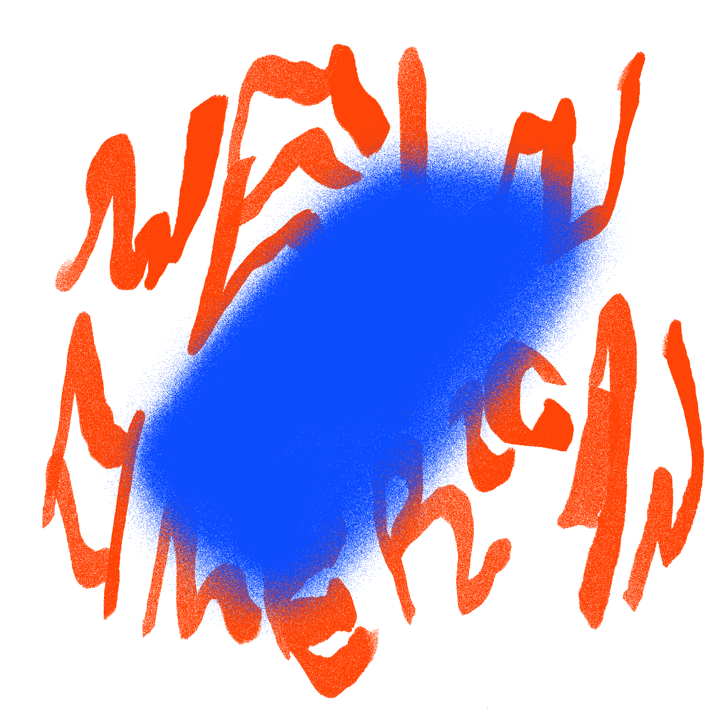

Lately I have been concerned about the proliferation of digital product interfaces emerging from California.

[more here]

Prior to Snapchat, cameras provided value only after the completion of a photographic process.

Film-based cameras required the development of light-altered paper with chemicals, digital cameras require bits to be arranged into an image on a small viewfinder on the body of a modern device. In each of these instances, captured light is reconfigured into a representative image, which is value.

Now, I tap on an app icon — the screen shifts, and I see the world again, through a viewfinder. It is the world I know.

I can edit my gender, apply a mask or haze upon the environment, cut and paste the world around me, and assemble a complete world without ever rendering captured light into a tertiary ‘view’ state.

Light is still processed through Snapchat, but at once, viewing and composing is an act of consuming — there is no point at which I need to press the shutter button to render light into image-value.

[more here]