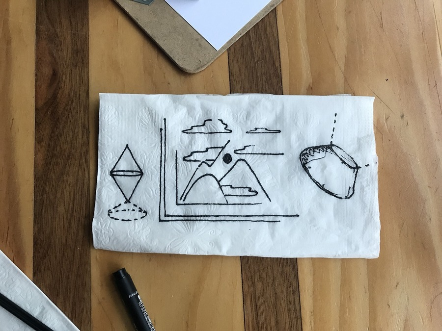
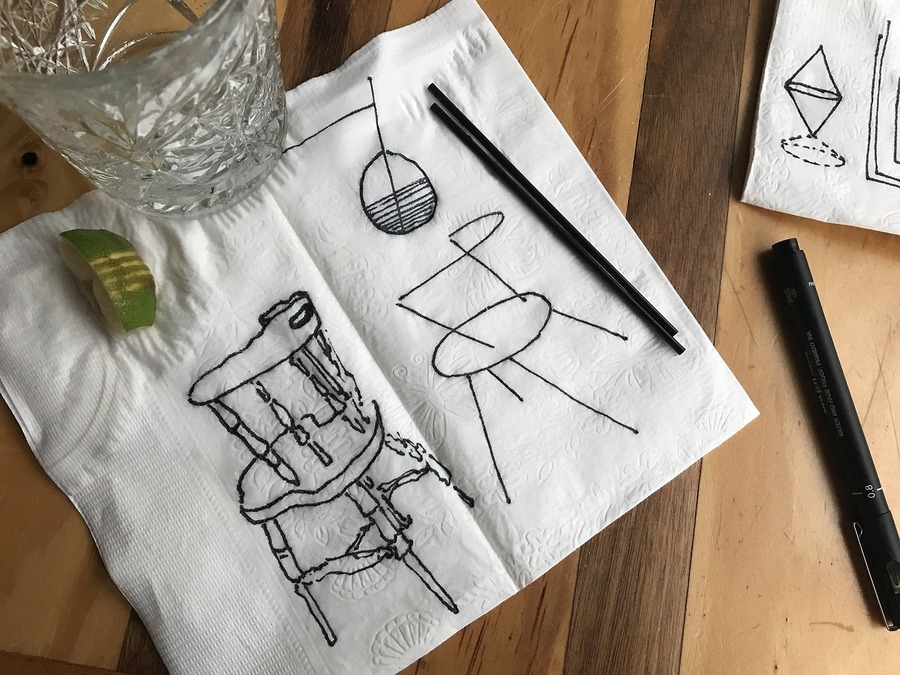

I was initially asked to design narrative/branding-related illustrations for [FOAM](https://foam.space/), a company building crypto-spatial protocols and standards. 

This is the set of napkin sketches posted on my Instagram that triggered our initial conversations:

A landscape and an eerily ethereum-looking form.

A chair, and a chair deconstructed.

—

Long story short, I *did not* end up creating illustrations for FOAM. 

Through a series of discussions on the current state of the product/project, I found myself working on a set of expressions for 

My early work consisted of very early-stage sketches or enunciations of a client interface for the FOAM location-based protocol. What follows is a description of the initial process of probing into the core offering of FOAM and expressing it in a variety of digital interfaces designed to accomodate for the average (non-technical) person.

—

