TL;DR: I co-founded and branded and built IBM Community Radio, a side–project–turned–platform for critical thought, culture renewal, and good music. I prototyped the initial front–end player/schedule interfaces, co-ordinated formative on-air content, and educated folks on how to get up and running quickly on the network. I also guerilla advertised the hell out of the first live broadcasts and earned us our initial notoriety within IBM's Austin design studio.

As of November 2016, IBM Community Radio had been cited as reaching “...between 5,000 and 6,000 people [within IBM] daily.”, according to [Fast Company](https://www.fastcompany.com/3065882/startup-report/ibms-unlikely-silo-buster-an-intranet-radio-station).

Here are some exciting images depicting how people felt about IBM Community Radio:

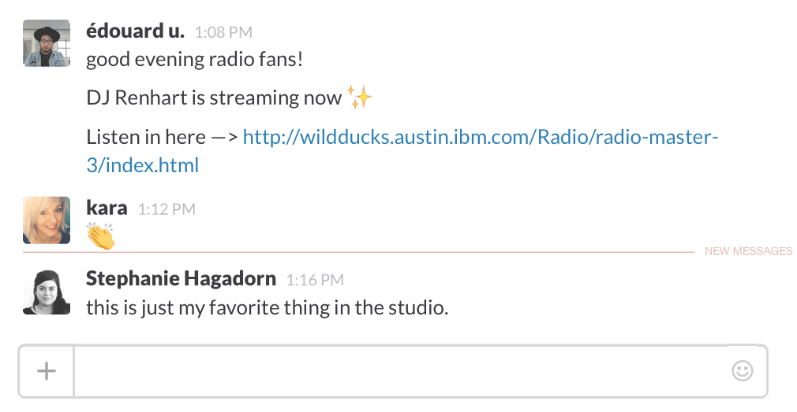

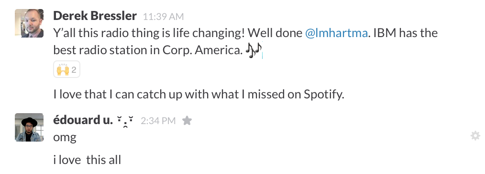

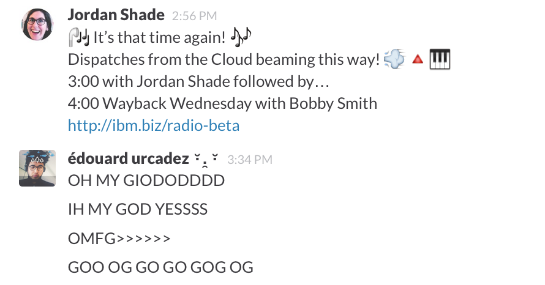

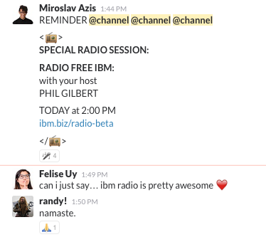

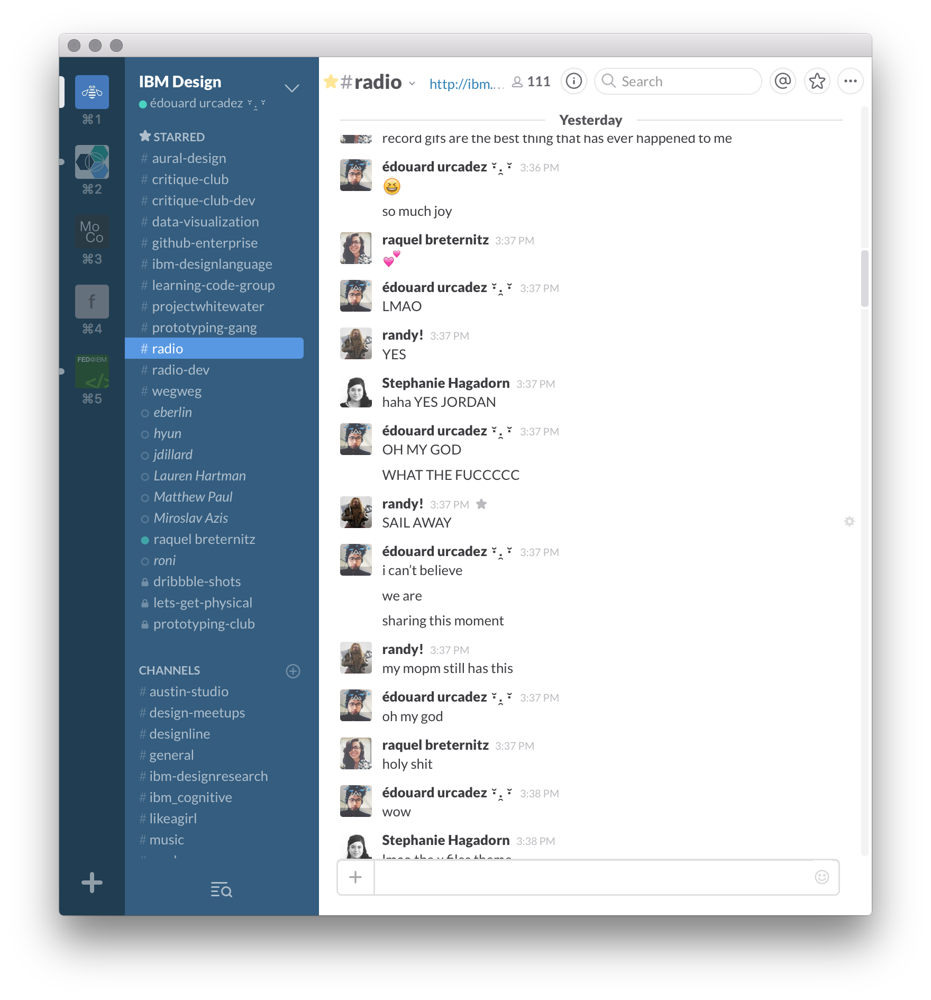

A quick video demo of beta functionality as of November 1, 2015:

<iframe src="https://player.vimeo.com/video/144302196" width="640" height="400" frameborder="0" webkitallowfullscreen mozallowfullscreen allowfullscreen></iframe>

Throughout 2015, Miroslav Azis and I had been bouncing back and forth the idea of _“emancipating our fellow designers from the shackles of our hyper-corporate day-to-day at IBM”_. Manifesting through a series of community-organizing projects which fizzled out one after another, we codenamed our efforts “Grand Unification Projects”.

Our shared interest in self-organization led to the discussion of various mediums through which people organized. We hit upon the notion of radio culture, specifically that found in academic/university contexts, and decided to begin prototyping a very rough "college radio station" embedded into IBM's intranet.

Miroslav had been able to quickly coordinate the aquisition of a physical server in Raleigh, from which we installed a general-purpose streaming software and an admin interface to queue music. We had the engine, and a method of queuing tracks, but there was no interface whatsoever that represented the content being delivered, or what the operation's reason for being may have been. I remedied this by spinning up a static page in our enterprise Github and linking it to the server–serving–music. It looked like this:

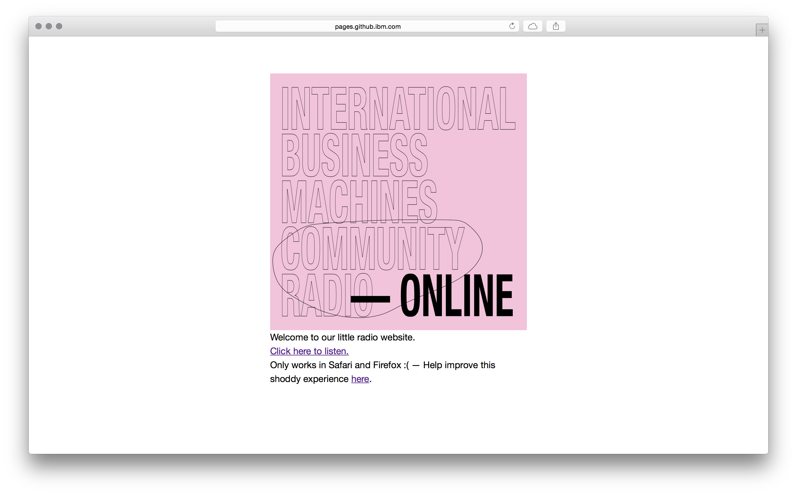

As indicated by the copy, I was clearly in need of some help. A friendly developer, Devan, helped us out with a rapid v2 that switched out my static link into a play/pause button, which functioned as a primitive on/off for the stream's sound output:

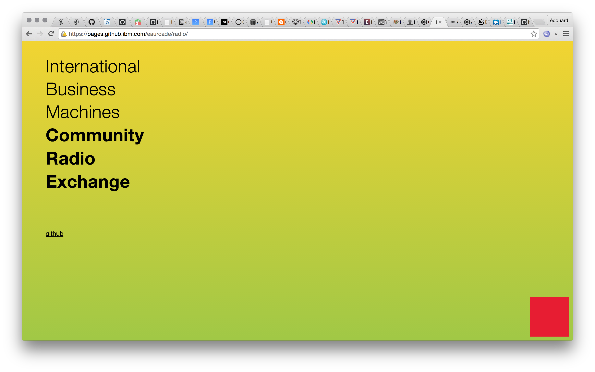

Devan also introduced a horrifying gradient at this time, but I was okay with this — our radio was still in its infancy and we were moving fast. I spent a good chunk of time soon after Devan's additions playing with some interfaces I thought would set us in a good direction. All the while, we were revolving through a small set of DJs (ourselves included) who were interested in broadcasting over many lunches and in our free time to test our systems. It was soon after our latest version that I began to explore methods of "branding" out our work, and giving further character to it:

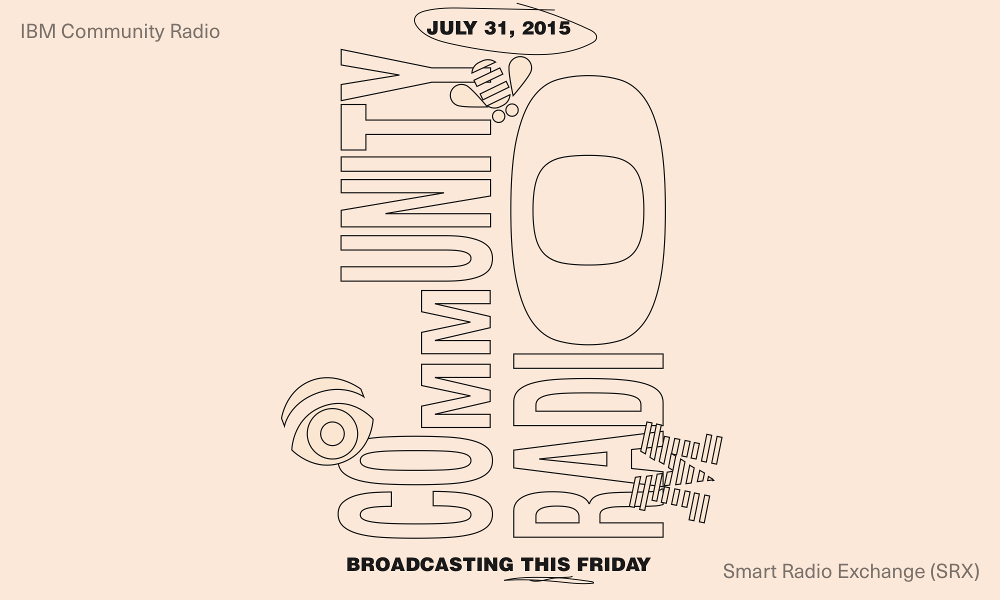

Above, an inaugural digital poster for our first non-test broadcast. I printed these out and scattered them in various public places in the studio.

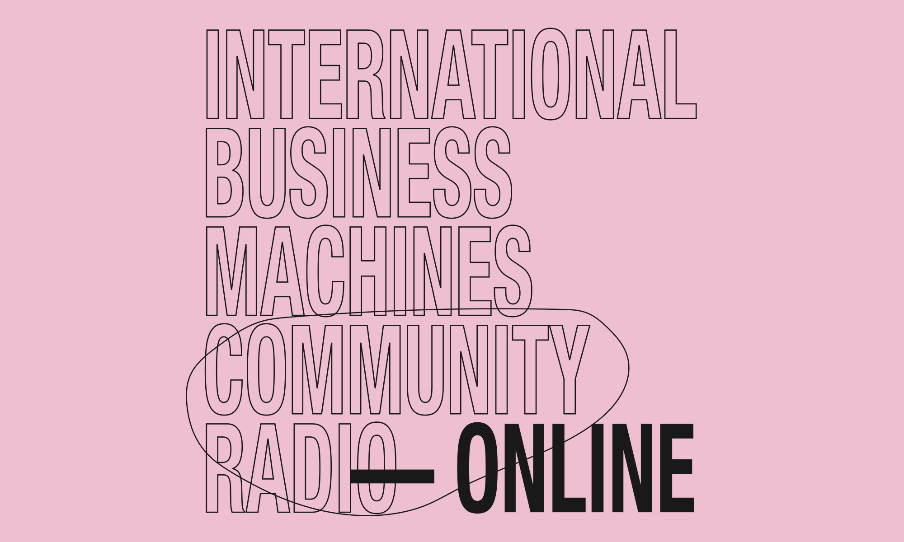

The front-page image we first used for our static site with radio link.

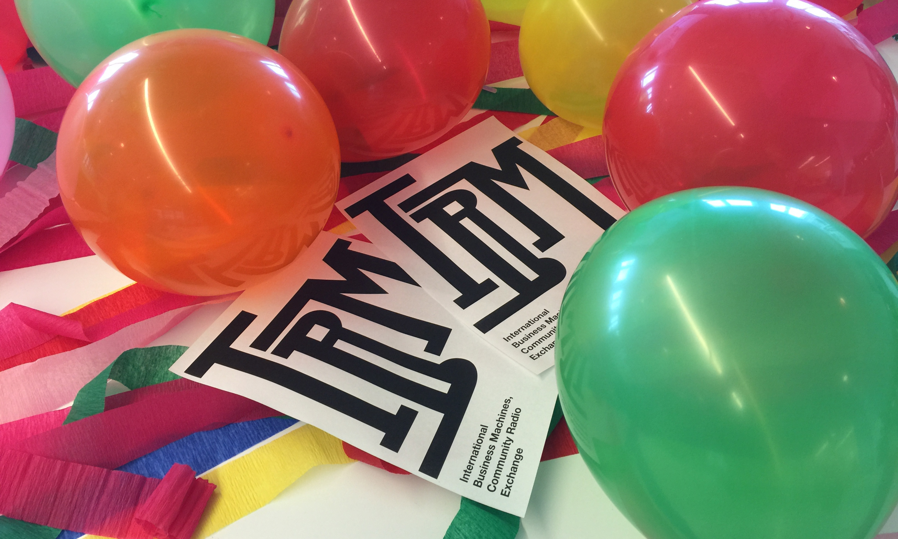

Amidst Pride Day streamers, a printed flyer for our day-of first broadcast. I would take any opportunity I could to produce physical artifacts for the radio.

<iframe src="https://share.framerjs.com/6tbeuyxvqoj3/" width="640" height="400" frameborder="0" webkitallowfullscreen mozallowfullscreen allowfullscreen></iframe>

I was heavily inspired by the twisting of our existing design language — up until this point, the efforts of distinguishing IBM's visual design were very much in flux, and it wasn't exactly kosher to fuck around with the elements sanctified by our Global Branding teams, our logotype included — I was drawn to the extending of the 8-bars that constituted the “I” in “IBM” and turned them on their side, representing them as EQ bars. It was around this time that I had begun to plug static designs into prototyping tooling (Framer primarily) and give them life:

<iframe src="https://edouerd.github.io/prototyping/framer/ibm/mobile-radio.framer/index.html" width="640" height="800" frameborder="0" webkitallowfullscreen mozallowfullscreen allowfullscreen></iframe>

While extending the functionality of designs was nice, I felt that what we most needed at the time was an actually-usable front end for our radio, so I began the task of prototyping a basic radio/scheduling interface in Codepen, which was much more responsive and design friendly than editing static files in Github. I ended up with this:

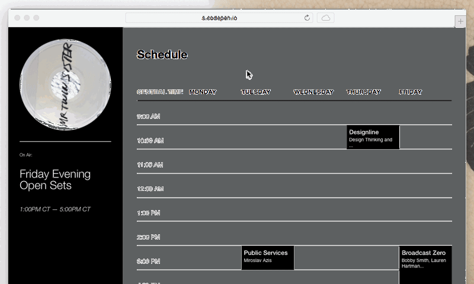

Soon after a few prototypes of this nature were completed, our tiny radio admin team was unexpectedly bolstered by the efforts of 5 full time developers, who had been hunting around the Austin studio for a "hack project" they could finish up in a week. More quickly than we had thought possible, our radio began to take form, and was soon equipped with the ability to log into the player itself and provide set/track titles, which were archived for later retrieval.

The 'beta' prototype video at the top of this case study is a working example of the radio interface at this point.

As we reached a proper “Version One”, we managed to secure studio funding for the purchase of broadcasting software for other stations around the world, and had begun to structure out how international radio programming would operate. The bulk of this work entailed hefty documentation, some of which I wrote and [made available on public github](https://github.com/edouerd/radio-setup). I ended up continuing this work on our internal instance, as it became more stable.

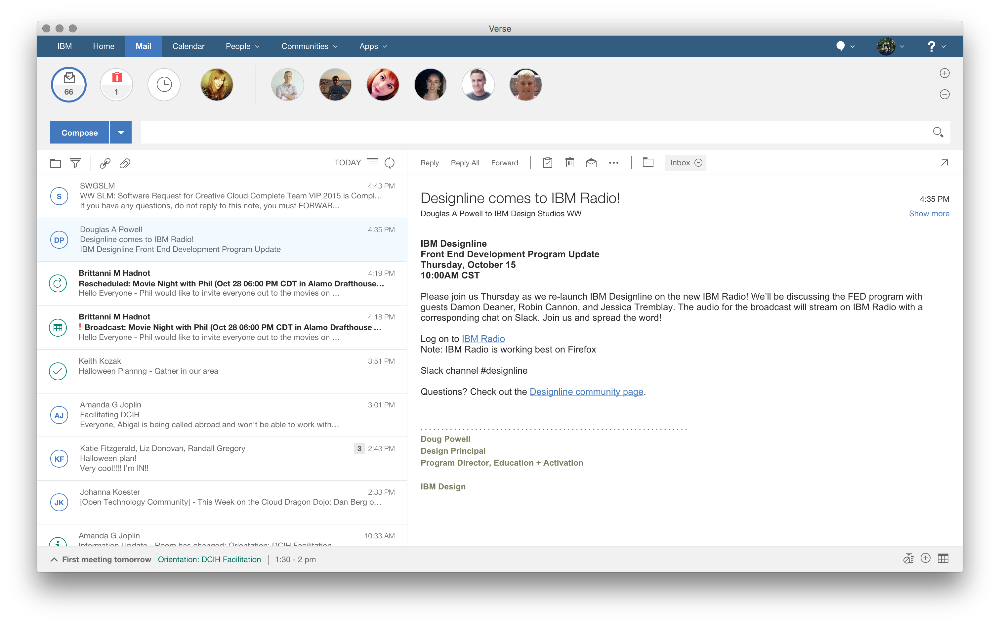

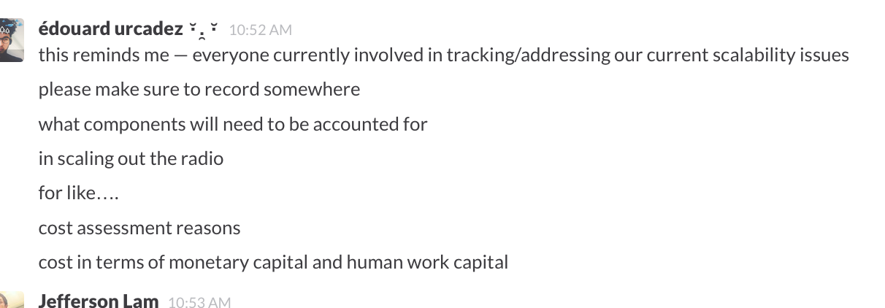

A few months before I left IBM, our community radio had been tasked with hosting a few high-load and mega-important events — Designline, a developer podcast-of-sorts that had existed long before our time was slated to be routed through IBM Community Radio. Ethan Marcotte, Gordon Bruce, and a host of other well-known folks were now broadcasted across IBM's design studios using our weirdo grassroots platform. Everything was going great, and to my knowledge, still is.

While IBM Community Radio is an intranet-only entity and likely will be for a long time, you can catch the fruits of our labor around SXSW at an IBM party.

IBM Community Radio was a seed of sorts in my practice, and my first attempt at self-organizing a "support structure" for a large group of people. Techniques from this community would find themselves used in the formation of [Learning Gardens](http://learning-gardens.co/), and most recently, [New Computer Working Group](http://newcomputers.group/).