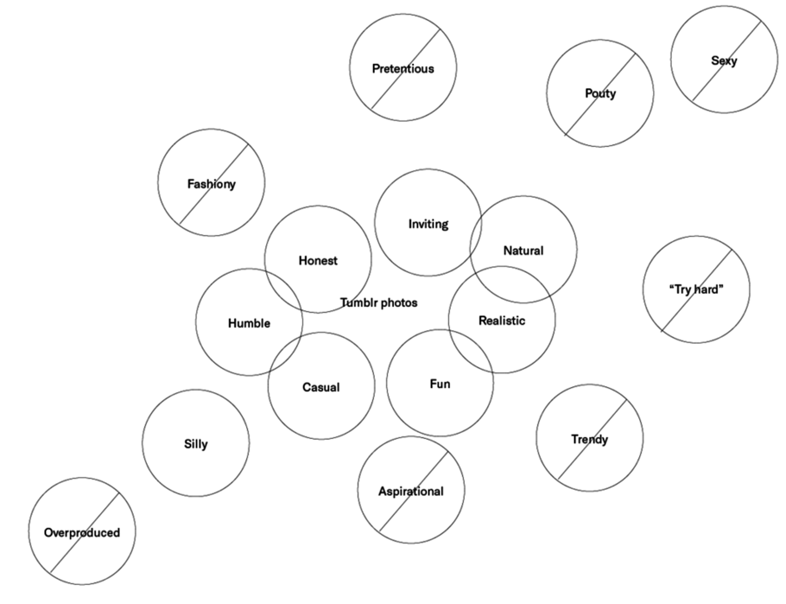
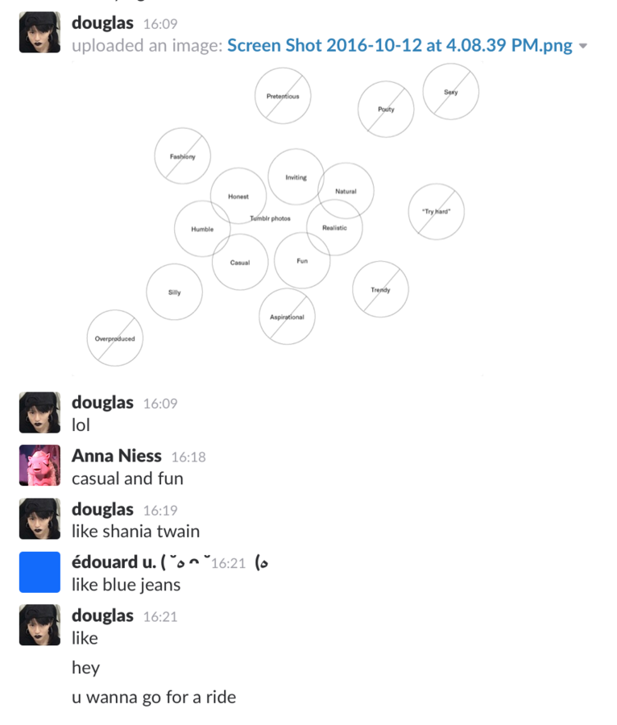
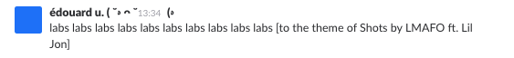
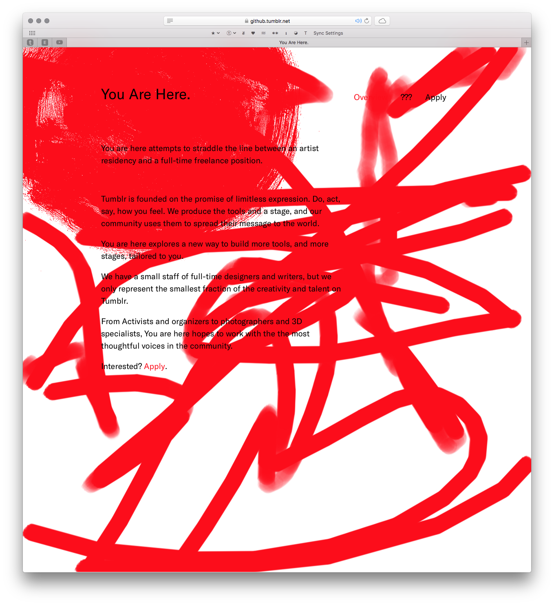
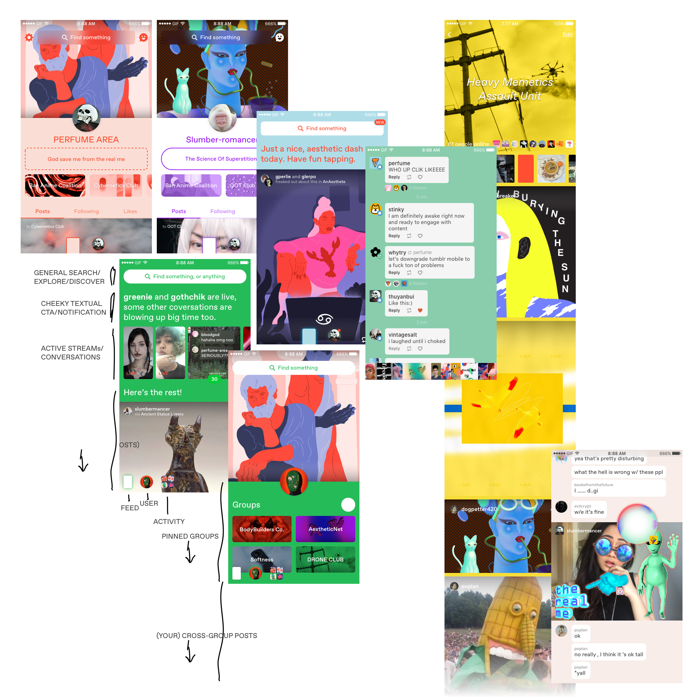

TL;DR: 

I've been designing 'how messaging works' across many scales and contexts, from the [one–to–one](https://support.tumblr.com/tagged/messaging) to the [many–to–many](https://support.tumblr.com/tagged/replies) — from system to user, and between users themselves. Related to this work, I've also been improving how we deal with self-moderation, user safety, and other security-related subjects.

At max, the size of our product design team has been four people. This means co-operating across product boundaries and informing one anothers' work has been crucial to getting meaningful work done. While "Messaging" and "User Safety" have been my primary spheres of work, I've contributed a fair share to many other aspects of the product–system.

Lastly, I've been involved with [Tumblr Labs](https://staff.tumblr.com/post/144154514205/willing-participants) as a council member/pseudo project manager, dreaming of a better and weirder blue hell site:

This is my tumblr: http://ed.tumblr.com/

Eventually, I need to get around to padding out some case studies and documentation for the following projects. 

If you're looking at this page to get an idea of what I'm doing at Tumblr, just email me and we can chat about whatever you'd like.

—

Product Designing:

1. Messaging — Icebreakers ([Friendly and non-technical overview](https://ministryofdesign.tumblr.com/post/157877099979/messaging-icebreakers))
1. Messaging — Medias and Inbox Consolidation
1. Messaging — Stickers
1. Activity — Notification Rollups
1. Activity — Notification System Refactor
1. User Safety — Blocking and Reporting
1. User Safety — [Safe Mode](https://techcrunch.com/2017/06/20/tumblr-rolls-out-new-content-filtering-tools-with-launch-of-safe-mode/)
1. Special Projects — Tumblr Scratch Ticket
1. Special Projects — Tumblr 2

Extracurricular Works:

1. http://labs.edouard.us/creativity-levels/index.html
1. http://labs.edouard.us/residency/
1. Tumblr Redpop — Gathering Learning Resources
1. http://labs.edouard.us/type-test/
1. Hack Day — Messaging MIDI

—

Here's some imagery for you visual types:

Design and prototype-development for Tumblr residency program, _You are Here_.

A variety of weird new expressions of what communicating on Tumblr could be.